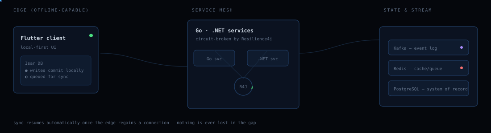
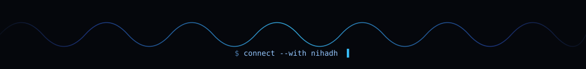

<div align="center">
  
</div>

<br/>

```
[boot] mounting profile...
[boot] role        : software engineer, systems-leaning
[boot] institution : University of Kelaniya — Software Engineering
[boot] standing    : Dean's List · CGPA 3.93/4.00
[boot] builds      : ERP · TMS · offline-first mobile · event-driven backends
[boot] status      : network optional, delivery not
[ok]   profile ready
```

<br/>

## the signal path

Every system I build follows the same shape: an edge that can go dark, a mesh that keeps working anyway, and a store that never contradicts itself once the two reconnect.

<div align="center">
  
</div>

<br/>

## skill matrix

Not a row of logos — a proficiency read-out. Fill level reflects how much of my recent work runs through each layer.

```
BACKEND
  Go            ████████████████░░░░  80%   microservices, concurrency-heavy services
  .NET / C#     ███████████████░░░░░  75%   enterprise APIs, business logic layers
  Kafka         █████████████░░░░░░░  65%   event streaming, topic design
  Redis         █████████████░░░░░░░  65%   caching, queues, session state
  Resilience4j  ████████████░░░░░░░░  60%   circuit breakers, retry/backoff policy

EDGE / MOBILE
  Flutter       ████████████████░░░░  80%   cross-platform offline-first clients
  Isar DB       ███████████████░░░░░  75%   local-first storage, sync engines

DATA
  PostgreSQL    █████████████████░░░  85%   system of record for every service above
  MongoDB       ███████████░░░░░░░░░  55%
  MySQL/SQLite  ██████████░░░░░░░░░░  50%

ALSO IN ROTATION
  TypeScript · Java · Kotlin · Dart · C · PHP · Docker · Next.js
```

<br/>

## failure modes considered

Instead of a features list, here's how each system behaves when something goes wrong — because that's the part that actually matters.

| scenario | what happens |
|---|---|
| **edge loses connectivity mid-transaction** | writes commit locally in Isar, get queued, replay in order the moment the link returns — nothing blocks, nothing is lost |
| **downstream service starts failing** | Resilience4j trips the breaker, requests fail fast instead of piling up, service self-heals on the next health check |
| **event consumer falls behind** | Kafka retains the log, consumer catches up from its offset — no replay logic bolted on after the fact |
| **cache goes cold or Redis restarts** | Postgres is always the source of truth, Redis is disposable by design |
| **two devices sync the same record** | conflict resolution is decided at design time, not discovered in production |

<br/>

## currently in progress

```
■ hybrid offline-first ERP ecosystem      — Isar-backed sync engine, multi-tenant
■ real-time logistics & payout engine     — Go + .NET + Kafka event pipeline
■ sensor-based IoT telemetry              — embedded devices → cloud dashboards
■ fault-tolerant service mesh             — Resilience4j patterns as a reusable template
```

<br/>

<div align="center">
  

  <a href="mailto:nihath854@gmail.com"></a>
  &nbsp;
  <a href="https://www.linkedin.com/in/nihadhiyan"></a>
  &nbsp;
  <a href="https://github.com/Nihadhiyan"></a>
</div>
