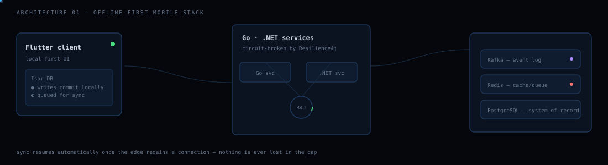
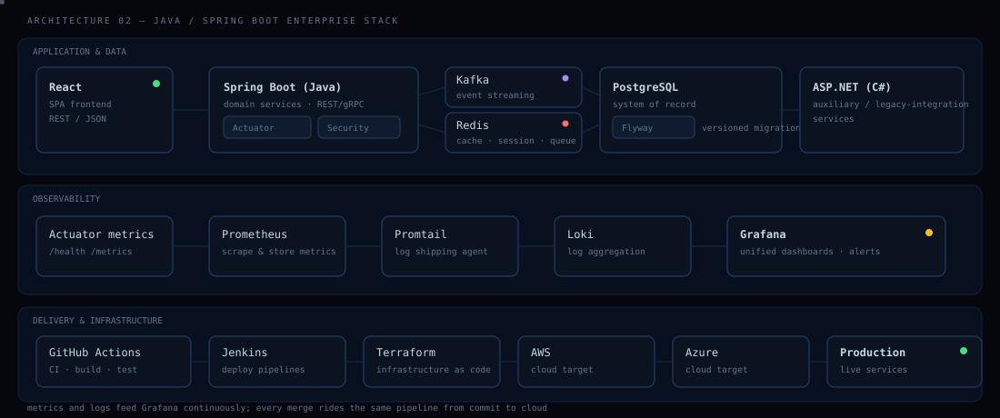
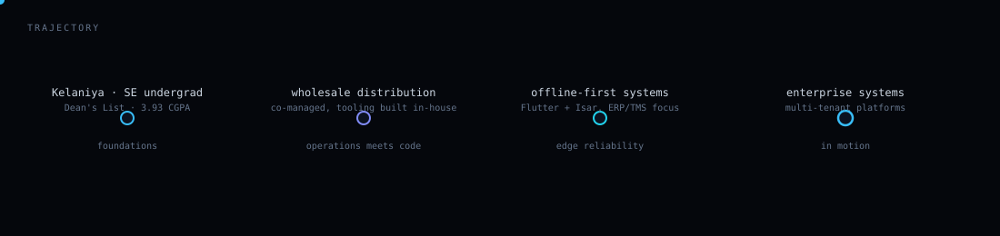

<div align="center">
  
</div>

<br/>

<div align="center">

**Software Engineer** building enterprise-grade backends and offline-capable systems —
from Spring Boot services running behind Kafka and Redis, to Flutter clients that keep
working when the network doesn't.

</div>

<br/>

```
[boot] mounting profile...
[boot] role        : software engineer — Java/Spring Boot, ASP.NET, distributed systems
[boot] institution : University of Kelaniya — Software Engineering
[boot] standing    : Dean's List · CGPA 3.93/4.00
[boot] builds      : enterprise APIs · offline-first mobile · event-driven backends
[boot] status      : network optional, delivery not
[ok]   profile ready
```

<br/>

## two architectures I build the most

I keep landing on the same two shapes: an **offline-first mobile stack** for field and
edge use cases, and a **Java/Spring Boot enterprise stack** for systems that live in the
cloud and need to prove they're healthy at every layer.

### 01 · offline-first mobile — Flutter, Go, .NET, Kafka

An edge that can go dark, a service mesh that keeps working anyway, and a store that
never contradicts itself once the two reconnect.

<div align="center">
  
</div>

<br/>

### 02 · Java/Spring Boot enterprise — React, Postgres, full observability, CI/CD

React on the front, Spring Boot services behind it, Postgres with Flyway-managed
migrations underneath, Kafka and Redis handling events and state — all watched by
Prometheus, Loki/Promtail, and Grafana, and shipped through GitHub Actions and Jenkins
into Terraform-provisioned AWS/Azure infrastructure.

<div align="center">
  
</div>

<br/>

## skill matrix

Not a row of logos — a proficiency read-out. Fill level reflects how much of my recent
work actually runs through each layer.

```
BACKEND
  Java / Spring Boot   █████████████████░░░  85%   REST APIs, Actuator, security, domain services
  ASP.NET / C#         ████████████████░░░░  80%   enterprise APIs, business logic layers
  Go                   █████████████░░░░░░░  65%   microservices, concurrency-heavy services
  Kafka                █████████████░░░░░░░  65%   event streaming, topic design
  Redis                █████████████░░░░░░░  65%   caching, queues, session state
  Resilience4j         ████████████░░░░░░░░  60%   circuit breakers, retry/backoff policy

EDGE / MOBILE
  Flutter              ████████████████░░░░  80%   cross-platform offline-first clients
  Isar DB              ███████████████░░░░░  75%   local-first storage, sync engines

DATA & DELIVERY
  PostgreSQL           █████████████████░░░  85%   system of record, Flyway migrations
  MongoDB              ███████████░░░░░░░░░  55%
  MySQL / SQLite       ██████████░░░░░░░░░░  50%
  Terraform / AWS/Azure ████████████░░░░░░░░  60%   IaC, cloud provisioning
  Jenkins / GH Actions  █████████████░░░░░░░  65%   CI/CD pipelines

OBSERVABILITY
  Prometheus / Grafana  █████████████░░░░░░░  65%   metrics + dashboards
  Loki / Promtail       ████████████░░░░░░░░  60%   centralized logging

ALSO IN ROTATION
  React · TypeScript · Kotlin · Dart · C · PHP · Docker · Next.js
```

<br/>

## failure modes considered

Instead of a features list, here's how each system behaves when something goes wrong —
because that's the part that actually matters.

| scenario | what happens |
|---|---|
| **edge loses connectivity mid-transaction** | writes commit locally in Isar, get queued, replay in order the moment the link returns — nothing blocks, nothing is lost |
| **a Spring Boot service starts failing** | Actuator health checks flag it, Prometheus alerts on the metric, Resilience4j trips the breaker so callers fail fast instead of piling up |
| **event consumer falls behind** | Kafka retains the log, the consumer catches up from its offset — no replay logic bolted on after the fact |
| **cache goes cold or Redis restarts** | Postgres is always the source of truth, Redis is disposable by design |
| **a bad migration ships** | Flyway versions every schema change, so rollback is a known, tested path — not a scramble |
| **something breaks in production at 2am** | Loki has the logs, Grafana has the dashboard, the on-call story is "look here" instead of "SSH in and guess" |

<br/>

## trajectory

<div align="center">
  
</div>

<br/>

## where the time actually goes

<div align="center">
  
</div>

<br/>

## currently in progress

```
■ Venue & Stall Reservation System — multi-tenant platform, Java Spring Boot enterprise
  backend, offline-first modern UI built with Flutter + Riverpod — under development
```

<br/>

<div align="center">
  

  <a href="mailto:nihath854@gmail.com"></a>
  &nbsp;
  <a href="https://www.linkedin.com/in/nihadhiyan"></a>
  &nbsp;
  <a href="https://github.com/Nihadhiyan"></a>
</div>
